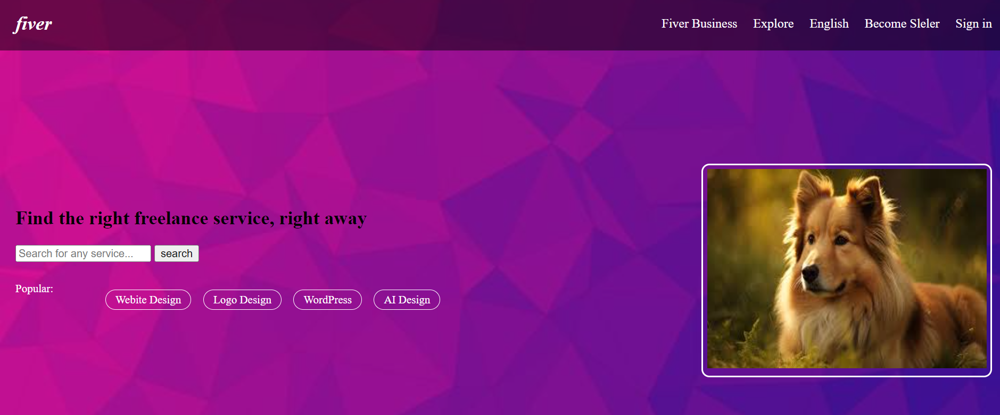

# Task 1: Fiver Landing Page

## Description
The Fiver Landing Page project aims to design a visually appealing landing page for a platform similar to Fiverr. It includes various sections such as a header with navigation menu, a hero section with a catchy headline, and a call to action button. HTML5 semantic elements are utilized for structuring the content, while CSS3 is employed for styling and layout.

## Sections

### Header Section
- The header section contains a navigation menu for easy access to different parts of the website.

### Hero Section
- The hero section features a captivating headline that highlights the platform's unique value proposition.
- A call to action button is included to encourage users to take the desired action.

## Screenshots

### Main Page

## Usage
To view the Fiver Landing Page, open the index.html file in a web browser.

## Credits
This project was designed and developed by Husnain Mahmood.